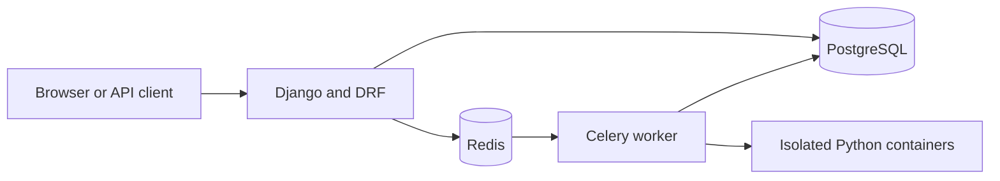

# Meadowcode

Meadowcode is a compact LeetCode-style coding platform built with Django and Django REST Framework. It provides a browser-based problem catalog and code editor, a JWT-authenticated API, asynchronous submission judging, user progress tracking, and problem discussions.

> The current judge accepts Python submissions only. Submitted code is executed in short-lived Docker containers with network access disabled and resource limits applied.

## Features

- Problem catalog with difficulty levels, tags, search, filtering, ordering, and pagination
- Browser UI for browsing problems, writing solutions, viewing verdicts, and discussing tasks
- JWT authentication, user profiles, ratings, and solved-problem counts
- Staff-managed problems, test cases, tags, and publication status through Django Admin
- Asynchronous judging with Celery and Redis
- Function-based Python test cases with JSON arguments and expected results
- Submission history with runtime, memory usage, and detailed verdicts
- Automatic progress tracking after the first accepted submission
- Discussion threads and comments with owner/staff permissions
- OpenAPI schema, Swagger UI and ReDoc
- Configurable API throttling and judge resource limits
- Pytest test suite

## Tech stack

- Python 3.12
- Django 5 and Django REST Framework
- PostgreSQL 16
- Celery and Redis 7
- Docker SDK for isolated code execution
- Simple JWT for authentication
- drf-spectacular for OpenAPI documentation
- Vanilla JavaScript and CSS for the frontend
- Pytest and pytest-django

## Architecture



A submission is saved with a `pending` status and queued in Redis. The Celery worker creates an isolated Docker container for each test case, records the verdict, and marks the problem as solved after the user's first accepted submission.

## Quick start with Docker

### Prerequisites

- Docker Desktop or Docker Engine
- Docker Compose v2
- Linux containers enabled

### 1. Configure the environment

```bash
cp .env.example .env
```

On Windows PowerShell:

```powershell
Copy-Item .env.example .env
```

The defaults in `.env.example` are suitable for local Docker development. Replace `DJANGO_SECRET_KEY` before using a non-local environment.

### 2. Build and start the services

```bash
docker compose up -d --build
```

This starts PostgreSQL, Redis, the Django development server, and the Celery worker.

### 3. Apply migrations

```bash
docker compose exec web python manage.py migrate
```

### 4. Create an administrator

```bash
docker compose exec web python manage.py createsuperuser
```

### 5. Open the application

- Frontend: <http://localhost:8000/>
- Django Admin: <http://localhost:8000/admin/>
- Swagger UI: <http://localhost:8000/api/docs/>
- ReDoc: <http://localhost:8000/api/redoc/>
- OpenAPI schema: <http://localhost:8000/api/schema/>
- Health check: <http://localhost:8000/api/health/>


To stop the project:

```bash
docker compose down
```

Add `--volumes` only when you also want to delete the local PostgreSQL data.


## API overview

All API paths use trailing slashes. List endpoints support page-number pagination; supported resources also expose filtering, search, and ordering through query parameters.

| Area | Endpoint | Access |
| --- | --- | --- |
| Health | `GET /api/health/` | Public |
| Registration | `POST /api/accounts/register/` | Public |
| Current user | `GET/PATCH /api/accounts/me/` | Authenticated |
| Obtain JWT | `POST /api/auth/token/` | Public |
| Refresh JWT | `POST /api/auth/token/refresh/` | Public |
| Problems | `/api/problems/` and `/api/problems/{slug}/` | Public read; staff write |
| Tags | `/api/problems/tags/` and `/api/problems/tags/{id}/` | Public read; staff write |
| Submissions | `/api/submissions/` and `/api/submissions/{id}/` | Authenticated; users see their own submissions |
| Threads | `/api/discussions/threads/` and `/api/discussions/threads/{id}/` | Public read; authenticated create; owner/staff write |
| Comments | `/api/discussions/comments/` and `/api/discussions/comments/{id}/` | Public read; authenticated create; owner/staff write |

Send JWT access tokens with requests as follows:

```http
Authorization: Bearer <access-token>
```

Example token request:

```bash
curl -X POST http://localhost:8000/api/auth/token/ \
  -H "Content-Type: application/json" \
  -d '{"username":"demo","password":"StrongPass123!"}'
```

## Submission verdicts

The judge can produce the following statuses:

- `pending`
- `running`
- `accepted`
- `wrong_answer`
- `time_limit`
- `memory_limit`
- `runtime_error`
- `compile_error`
- `internal_error`

Although the data model defines additional language choices, the API currently rejects every language except `python`.

## Configuration

Configuration is read from `.env`. See `.env.example` for the full list.

| Variable group | Purpose |
| --- | --- |
| `DJANGO_*` | Settings module, secret key, debug mode, hosts, CSRF origins, and time zone |
| `POSTGRES_*` | PostgreSQL database connection |
| `CELERY_*` | Redis broker, result backend, eager mode, and task time limit |
| `JWT_*` | Access and refresh token lifetimes |
| `DRF_*` | Pagination and throttle rates |
| `JUDGE_PYTHON_IMAGE` | Docker image used to run Python submissions |
| `JUDGE_PULL_IMAGE` | Pull the judge image before execution when enabled |
| `JUDGE_*_LIMIT*` | Execution timeout, output, process, CPU, and memory-related safeguards |

The Celery container mounts `/var/run/docker.sock` so that the worker can create judge containers through the host Docker daemon. If the worker reports that the Docker daemon or judge image is unavailable, verify socket access and pull the configured image:

```bash
docker pull python:3.12-slim
```


## Project structure

```text
apps/
  accounts/       User accounts and profiles
  core/           Health check, frontend views, and shared permissions
  discussions/    Problem threads and comments
  judge/          Celery task and Docker-based Python runner
  problems/       Problems, tags, test cases, and progress
  submissions/    Submission API and verdict data
config/            Django, Celery, ASGI, and WSGI configuration
static/frontend/   Browser-side JavaScript and styles
templates/         Django frontend templates
tests/             API, frontend, judge, schema, and throttling tests
```

## Security note

Running untrusted code is security-sensitive. Meadowcode applies container isolation, disables networking, drops Linux capabilities, runs as a non-root user, and enforces resource limits. These controls are useful for development, but a public production judge should also use dedicated worker hosts, stronger sandboxing, monitoring, rate limits, and regular image and dependency updates.

The supplied Docker Compose configuration runs Django's development server and is intended for local development, not production deployment.
